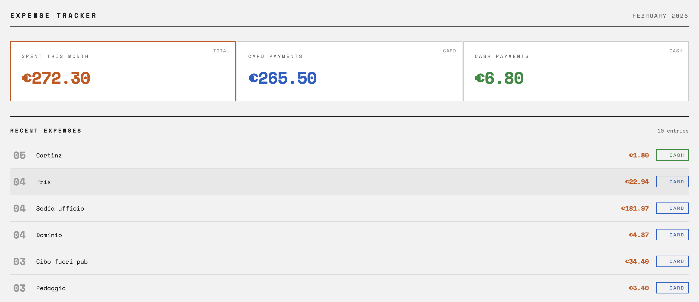

# spendlocal

**Your money. Your data. Your server.**

A privacy-first expense tracker that runs entirely on your own hardware. No cloud accounts. No bank connections. No subscriptions.

[](LICENSE)
[](https://www.python.org/downloads/)
[](#)

---

## Why spendlocal?

Every expense tracker wants access to your bank account. They promise convenience in exchange for your complete financial history — every transaction, every merchant, every spending pattern.

**spendlocal** takes a different approach:

- Runs on hardware you own (Raspberry Pi, old laptop, NAS)
- Data never leaves your network
- No accounts to create, no terms to accept
- Works offline, forever

## How it works

```
┌─────────────────────────────────────────────────────────┐
│  iPhone                                                 │
│  ├─ Pay with Apple Wallet                               │
│  └─ iOS Shortcut prompts: "What? How much?"             │
└─────────────────────┬───────────────────────────────────┘
                      │ HTTP POST (via Tailscale VPN)
                      ▼
┌─────────────────────────────────────────────────────────┐
│  Your Server (Raspberry Pi, ThinkPad, anything)         │
│  ├─ Flask receives and validates                        │
│  ├─ SQLite stores locally                               │
│  └─ Dashboard shows totals                              │
└─────────────────────────────────────────────────────────┘
```

## Screenshot



*Minimal interface. Monthly totals. Card vs cash breakdown. That's it.*

## Quick Start

### 1. Clone and install

```bash
git clone https://github.com/rogi2709/spendlocal.git
cd spendlocal
python3 -m venv .venv
source .venv/bin/activate
pip install flask
```

### 2. Initialize database

```bash
sqlite3 expenses.db < schema.sql
```

### 3. Run

```bash
python app.py
```

Open `http://localhost:5000` — you're done.

### 4. Connect your phone

1. Install [Tailscale](https://tailscale.com) on server and iPhone
2. Import the iOS Shortcut (see [shortcut/README.md](shortcut/README.md))
3. Optional: Set up Apple Wallet automation

## Features

| Feature | spendlocal | Cloud Apps |
|---------|-----------|------------|
| Bank connection required | No | Yes |
| Account signup | No | Yes |
| Monthly fee | €0 | €5-15 |
| Data location | Your server | Their servers |
| Works offline | Yes | No |
| Open source | Yes | Rarely |

## Requirements

- Python 3.10+
- Any Linux/macOS machine (runs great on a Raspberry Pi Zero)
- 10 MB disk space
- [Tailscale](https://tailscale.com) (free tier) for mobile access

## Project Structure

```
spendlocal/
├── app.py                 # Flask application (< 100 lines)
├── schema.sql             # SQLite schema
├── templates/
│   └── index.html         # Dashboard
├── static/
│   └── style.css          # Minimal styling
├── shortcut/
│   └── README.md          # iOS Shortcut setup guide
└── systemd/
    └── spendlocal.service # Auto-start on boot
```

## API Reference

### `POST /add`

Log an expense.

```bash
curl -X POST http://localhost:5000/add \
  -H "Content-Type: application/json" \
  -d '{
    "title": "Coffee",
    "amount": 4.50,
    "account": "Card",
    "date": "2026-02-05"
  }'
```

**Response:** `{"success": true, "message": "Expense added"}`

### `GET /`

Dashboard with monthly totals and recent expenses.

### `GET /health`

Health check. Returns `{"status": "ok"}`.

## Run on Boot

```bash
# Edit the service file with your username
nano systemd/spendlocal.service

# Install and enable
sudo cp systemd/spendlocal.service /etc/systemd/system/
sudo systemctl enable spendlocal
sudo systemctl start spendlocal
```

## Security

spendlocal has no authentication by default. Security comes from your network:

- **Tailscale** creates a private mesh VPN — only your devices can connect
- The server never touches the public internet
- No ports exposed to the world

If you need authentication (shared household, etc.), PRs welcome.

## Philosophy

> "The best expense tracker is one you actually use."

spendlocal is intentionally minimal:

- No categories (you know what "Groceries" means)
- No budgets (that's a different problem)
- No charts (open a spreadsheet if you need them)
- No AI insights (you don't need a robot to tell you coffee is expensive)

It answers one question: **Where did my money go this month?**

## Contributing

Found a bug? Have an improvement? PRs welcome.

Please keep the philosophy in mind: simple > feature-rich.

## License

MIT — do whatever you want with it.

## Credits

Built by [Igor Lazic](https://thelocalstack.eu).

Read the full story: [I Built an Expense Tracker That Never Leaves My House](https://thelocalstack.eu/posts/expense-tracker/)

---

**Your money. Your data. Your server.**
